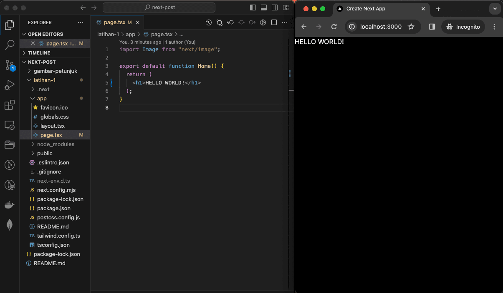
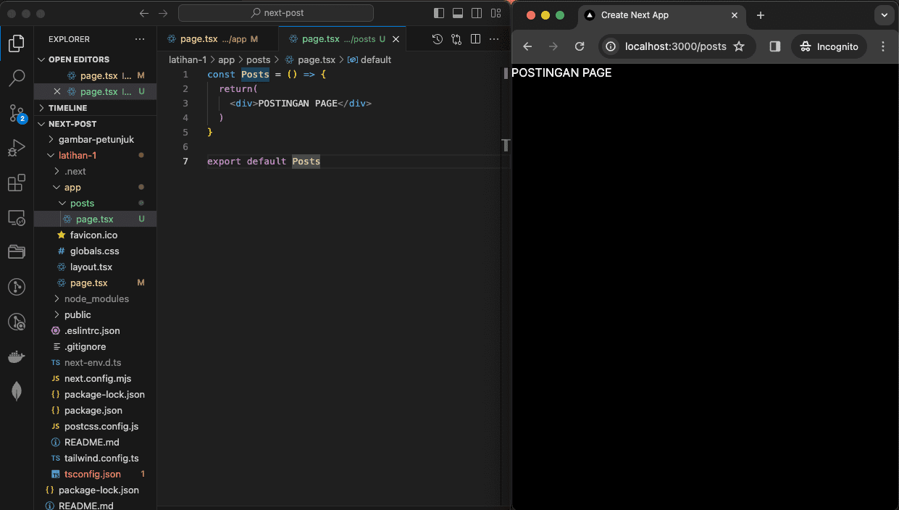
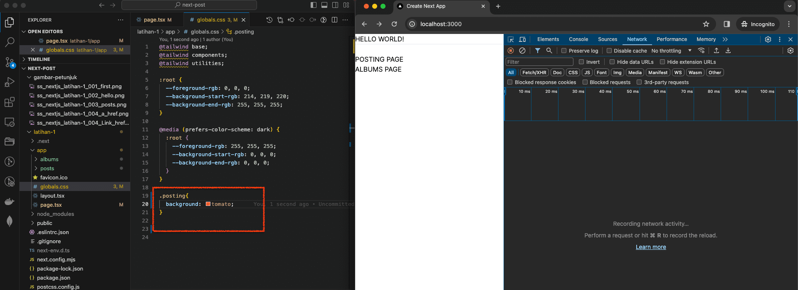

# &#x1F6A9; Next.JS app Router and vercel

&nbsp;

<!-- **Reference:** 
- YT "Tutorial NEXT JS 13 App Router"
   
https://www.youtube.com/watch?v=WyTIjLegirE

   last 24.59s

 

- YT "Mudah Untuk Deploy NextJS Project di Vercel via GIT atau CLI | Dev Insight | MauCoding"
   
https://www.youtube.com/watch?v=4FALuQOWqT8
 -->

&nbsp;

### &#x1F530; Begin [ latihan-1 ]: 

<pre>
   ❯ node --version
      v18.17.0

   ❯ npm --version
      9.6.7

   ❯ npx --version
      9.6.7
</pre>
<pre>
   ❯ npx create-next-app@latest
      Need to install the following packages:
      create-next-app@14.1.4
      Ok to proceed? (y) 
      ? What is your project named? › latihan-1
      ? Would you like to use TypeScript? › Yes
      ? Would you like to use ESLint? Yes
      ? Would you like to use Tailwind CSS? › Yes
      ? Would you like to use `src/` directory? › No
      ? Would you like to use App Router? (recommended) › Yes
      ? Would you like to customize the default import alias (@/*)? › No

      Creating a new Next.js app in /Users/.../next-post/latihan-1.

      Using npm.

      Initializing project with template: app-tw 

      Installing dependencies:
      - react
      - react-dom
      - next

      Installing devDependencies:
      - typescript
      - @types/node
      - @types/react
      - @types/react-dom
      - autoprefixer
      - postcss
      - tailwindcss
      - eslint
      - eslint-config-next

      added 369 packages, and audited 370 packages in 10s

      136 packages are looking for funding
      run `npm fund` for details

      found 0 vulnerabilities
      Initialized a git repository.

      Success! Created latihan-1 at /Users/.../next-post/latihan-1      
</pre>

<pre>
   ❯ du -sch latihan-1
      317M    latihan-1
</pre>

Test jalankan pertama kali.
<pre>
   ❯ cd latihan-1

   ❯ npm run dev

      > latihan-1@0.1.0 dev
      > next dev

         ▲ Next.js 14.1.4
         - Local:        http://localhost:3000

      ✓ Ready in 1495ms
</pre>

---

&nbsp;

**Struktur files:** 
<pre>
   ❯ tree -L 3 -a -I 'README.md|.DS_Store|node_modules|.next' ./latihan-1
      ./latihan-1
      ├── .eslintrc.json
      ├── .git.tgz
      ├── .gitignore
      ├── app
      │   ├── albums
      │   │   └── page.tsx
      │   ├── favicon.ico
      │   ├── globals.css
      │   ├── layout.tsx
      │   ├── page.tsx
      │   └── posts
      │       ├── page.tsx
      │       └── postPage.module.css
      ├── next-env.d.ts
      ├── next.config.mjs
      ├── package-lock.json
      ├── package.json
      ├── postcss.config.js
      ├── public
      │   ├── next.svg
      │   └── vercel.svg
      ├── tailwind.config.ts
      └── tsconfig.json

      4 directories, 19 files
</pre>

&nbsp;

### Preview Stages latihan-1

    
    
nextjs : first.

 

    
    
nextjs : hello.

 

    
    
nextjs : page posts.

 

    
    
nextjs : link a href.

 

    
    
nextjs : Link href.

 

    
    
nextjs : css global.

 

    
    
nextjs : css global.

 

    
    
nextjs : tailwind.

 

&nbsp;